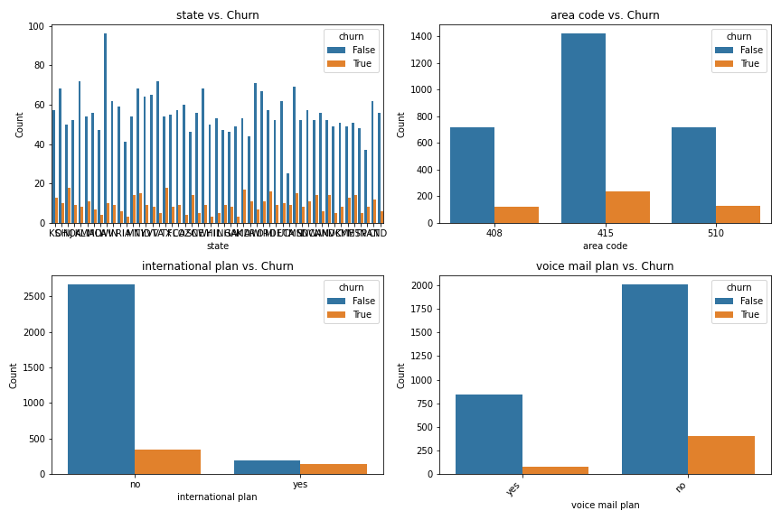
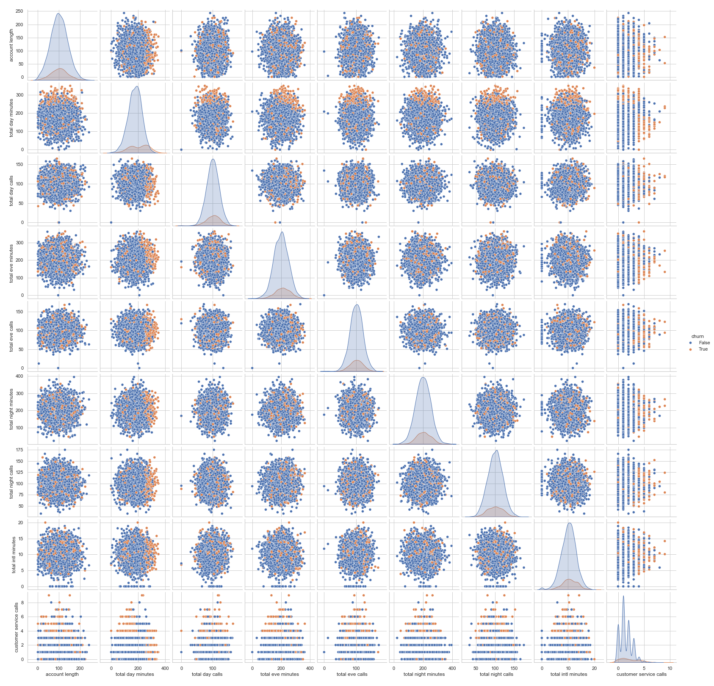

### **THE CHURN FACTOR: UNLOCKING CUSTOMER ROYALTY IN TELECOM**

#### BUSINESS UNDERSTANDING

Understanding telecom customer churn is crucial for businesses in the telecommunications industry, as it directly impacts revenue, customer retention, and overall profitability. Customer churn can be voluntary because of dissatisfaction in the services by the service provider and it can also be involuntary because of service disruption or payment issues. Understanding customer churn rates can have financial implications to the provider. Maintaining current customers is cheaper than that acquiring new ones. Analysing churn rates can give an advantage over competitors. This project aims to predict whether a customer will churn or not depending on the several factors on the datasets.

#### DATA UNDERSTANDING

This SyriaTel data is from https://www.kaggle.com/datasets/becksddf/churn-in-telecoms-dataset, a Telecommunication company. The dataset contains information about customer churn, which is a significant problem for telecom companies. The goal is to predict whether a customer will churn or not. The dataset contains the following columns:'state', 'account length', 'area code', 'phone number','international plan', 'voice mail plan', 'number vmail messages','total day minutes', 'total day calls', 'total day charge','total eve minutes', 'total eve calls', 'total eve charge','total night minutes', 'total night calls', 'total night charge','total intl minutes', 'total intl calls', 'total intl charge','customer service calls', 'churn'

**Data Visualization**
The dataset is visualized using the following plots:
1. Churn Distribution

The plot indicates a churn rate of 14.49%. This means that approximately 14.49% of customers have left or are likely to leave the company.The majority of customers (represented by the blue bar) have not churned (False). The smaller pink bar represents the portion of customers who have churned (True).
Customer Retention: The company has a relatively high proportion of customers who have remained loyal.
Churn Prevention: Despite the majority of customers staying, the churn rate of 14.49% suggests that there is room for improvement in customer retention efforts.

2. Count Plot

State: The plot shows that the number of churned customers is relatively consistent across different states, with a few states having slightly higher or lower churn rates.
Area Code: While the area code 415 has the highest number of customers, the churn rates across the three area codes (408, 415, and 510) are relatively similar.
International Plan: Customers with an international plan have a significantly higher churn rate compared to those without.
Voice Mail Plan: Customers with a voice mail plan have a slightly lower churn rate compared to those without.
International Plan: The international plan seems to be a strong predictor of churn. The company may want to investigate why customers with international plans are more likely to churn.
Voice Mail Plan: While the effect is less pronounced, having a voice mail plan appears to be slightly correlated with lower churn rates.
State and Area Code: While there are some variations in churn rates across states and area codes, these factors do not seem to be as significant as the international plan and voice mail plan.

3. International plan vs Churn

The plot suggests a strong association between having an international plan and customer churn. Customers who subscribed to the international plan are more likely to churn compared to those who did not. This could indicate potential issues or dissatisfaction with the international plan service, which might be worth investigating further.

4. Pairplot

*Distributions*

Features like 'customer service calls' and 'account length' show skewed distributions, suggesting they may have an impact on churn. The "customer service calls" feature appears to have distinct separations in churn behavior (many churned customers made a higher number of service calls).

*Relationships*

The scatter plots show the correlation between features and churn rates. For example, high total day minutes or total eve minutes don’t seem to correlate strongly with churn, given the scattered distribution.
customer service calls seems to show some level of separation between churn and non-churn classes, implying it might be a significant predictor.

**Data Preparation**
1. Data Cleaning where all missing values were handled and duplicates were dropped.
2. Data Transformation where all categorical variables were converted to numerical variables using one-hot encoding.
3. Feature Scaling where all numerical variables were scaled using StandardScaler from scikit-learn library.
4. Splitting the dataset into training and testing sets using train_test_split function from scikit-learn library.

**Modelling**
Three different models were used inorder to compare which one has the best accuracy scores and recall precision balance.
The models used were:
1. *Logistic regression which was the baseline model*

The logistic model was used a baseline model. This model however performed poorly in terms of recall and precision balance. The first model was build from a subset of features that had a huge impact on customer churn. These features include: 'customer service calls', 'total day minutes', 'total night minutes', 'total intl minutes', 'account length', 'churn'. The model however struggled to predict the correct instances. 
The second logistic regression model was built with all the features and still struggled to correctly identify positive instances. This might be due to data complexity.

2. *Decision tree*

The decision tree performed excellently maintaining a good balance between precision and recall.

3. *Random Forest Classifier*

The random forest model show that it has achieved an accuracy of 96.85%, which is excellent. The precision, recall, and F1-score are also high

**Model Evaluation**
The models were evaluated using metrics such as accuracy, precision, recall and f1 score. 
In this particular problem the main focus was to correctly positive instances, that it correctly predict customer churn. F1 score was used to check for the balance between precision and recall. Random forest correctly achieved that making it the prefered model for this task.

##### **CONCLUSION**

The logistic regression model performed poorly even after multiple class weights adjustments and hyperparameter tuning, the recall scores were still too low. The overall Conclusion is that there might be data complexity leading to poor performance of the model.

Based on the provided metrics, both the decision tree model and the random forest model with balanced class weights demonstrate strong performance on the test data.

Decision Tree Model:

Achieves an accuracy of 98.05%.
Has high precision (1.0) and recall (0.87) for the positive class.
F1-score of 0.93 indicates a good balance between precision and recall.

Random Forest Model with Balanced Class Weights:

Achieves an accuracy of 95.80%.
Has high precision (1.0) and recall (0.72) for the positive class.
F1-score of 0.91 indicates a good balance between precision and recall.
Comparison:

The decision tree model has a slightly higher overall accuracy (98.05% vs. 95.80%).
The random forest model with balanced class weights has a slightly higher recall for the positive class (0.72 vs. 0.87).
Recommendation:

While both models perform well, the decision tree model might be slightly preferred due to its higher overall accuracy. In this case recall for the positive class is a critical factor, so random forest model with balanced class weights is be a better choice.

##### **NEXT STEPS**
1. Deploy Model:
Integration: Integrate the chosen model into the production environment.
Monitoring: Implement monitoring mechanisms to track model performance over time and detect potential issues.

2. Continuous Improvement:
Data Updates: Regularly updating the training data to maintain model accuracy.
Retraining: Retrain the model periodically to adapt to changes in data distribution.
Model Evaluation: Continuously evaluate model performance and make necessary adjustments.

3. Explore Other Techniques:
Ensemble Methods: Considering ensemble techniques like stacking or boosting to combine multiple models and potentially improve performance.
Deep Learning: Explore deep learning models (e.g., neural networks)

